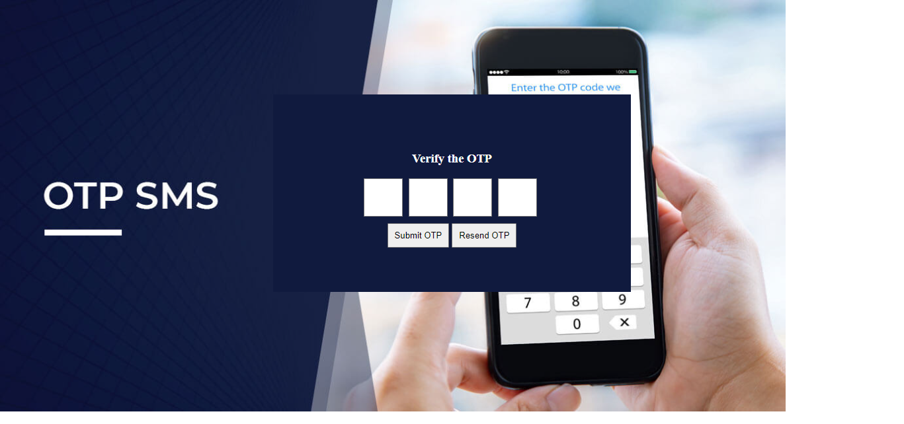

# EasyShop

# Project Documentation

## Project Overview

This project is a Node.js application that provides functionality for user authentication, product management, and an e-commerce platform. It includes two main modules: `userRouter` for user-related operations (registration, login, profile update, and token management), and `productRouter` for managing products (creation, retrieval, updating, and deletion).

## Table of Contents

1. [User Module](#user-module)
   - [Register](#register)
   - [Login](#login)
   - [Update Profile](#update-profile)
   - [Token Management](#token-management)
     - [Refresh Token](#refresh-token)
     - [Logout](#logout)
  
2. [Product Module](#product-module)
   - [Create Product](#create-product)
   - [Retrieve Products](#retrieve-products)
   - [Update Product](#update-product)
   - [Delete Product](#delete-product)

## User Module

### Register

Endpoint: `POST /register`

- **Description**: Registers a new user with the provided information.
- **Request Body**:
  - `name`: User's name
  - `email`: User's email
  - `password`: User's password
  - `address`: User's address
- **Response**:
  - Success: `{ "msg": "New User registered" }`
  - Failure: `{ "msg": "User already exists, please login" }` or `{ "msg": "Something went wrong", "error": "Error details" }`

### Login

Endpoint: `POST /login`

- **Description**: Authenticates a user based on email and password, returning a JWT token on success.
- **Request Body**:
  - `email`: User's email
  - `password`: User's password
- **Response**:
  - Success: `{ "msg": "Login successful", "token": "userToken" }`
  - Failure: `{ "msg": "Credentials not found" }` or `{ "msg": "Wrong Credentials" }`

### Update Profile

Endpoint: `PUT /updateprofile`

- **Description**: Updates a user's profile information.
- **Request Body**:
  - `userID`: User's ID
  - `name`: New user name (optional)
  - `email`: New user email (optional)
  - `password`: New user password (optional)
  - `address`: New user address (optional)
- **Response**:
  - Success: `{ "msg": "User profile updated successfully" }`
  - Failure: `{ "msg": "User not found" }` or `{ "msg": "Something went wrong", "error": "Error details" }`

### Token Management

#### Refresh Token

Endpoint: `POST /refresh-token`

- **Description**: Generates a new JWT token based on the provided refresh token.
- **Request Body**:
  - `refreshToken`: Refresh token
- **Response**: `{ "token": "newToken" }`

#### Logout

Endpoint: `POST /logout`

- **Description**: Logs out a user by blacklisting the provided token.
- **Request Body**:
  - `token`: Token to be blacklisted
- **Response**:
  - Success: `{ "msg": "Logout successful" }`
  - Failure: `{ "msg": "Token is already blacklisted" }` or `{ "msg": "Something went wrong" }`

## Product Module

### Create Product

Endpoint: `POST /create`

- **Description**: Creates a new product based on the provided information.
- **Request Body**:
  - `Catogory`: Product category (`men's clothing` or `women's clothing`)
  - `Title`: Product title
  - `Image`: Product image URL
  - `Description`: Product description
  - `Price`: Product price
  - Additional fields specific to the product category
- **Response**:
  - Success: `{ "msg": "Product registered on site", "product": { /* Product details */ } }`
  - Failure: `{ "msg": "Invalid category" }` or `{ "msg": "Not able to add", "error": "Error details" }`

### Retrieve Products

Endpoints:
- `GET /allmenproducts`: Retrieves all men's products
- `GET /allwomenproducts`: Retrieves all women's products

- **Response**: Array of product objects

### Update Product

Endpoint: `PATCH /update/:id`

- **Description**: Updates a product based on the provided information.
- **Request Parameters**:
  - `id`: Product ID
- **Request Body**:
  - `Catogory`: Product category (`men's clothing` or `women's clothing`)
  - Fields to be updated
- **Response**:
  - Success: `{ "msg": "Product updated successfully", "product": { /* Updated product details */ } }`
  - Failure: `{ "msg": "Invalid category" }` or `{ "msg": "Error updating product" }`

### Delete Product

Endpoint: `DELETE /delete/:id`

- **Description**: Deletes a product based on the provided ID.
- **Request Parameters**:
  - `id`: Product ID
- **Response**:
  - Success: `{ "msg": "Product deleted successfully", "product": { /* Deleted product details */ } }`
  - Failure: `{ "msg": "Invalid category" }`, `{ "msg": "Product not found" }`, or `{ "msg": "Error deleting product" }`

## Screenshots

### Register Page

### Login Page

### Index Page

### Women's Product Page

### Men's Product Page

### Cart Page

### OTP Page

### Receipt Page

